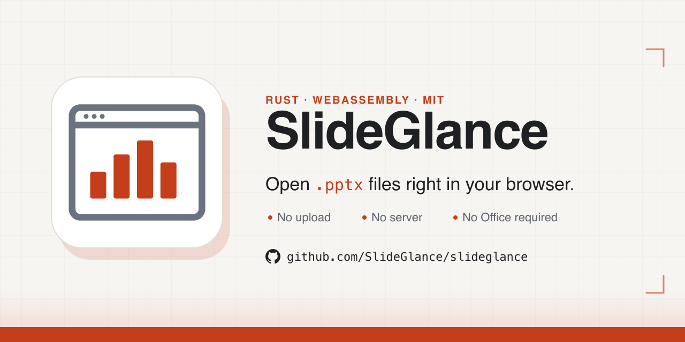
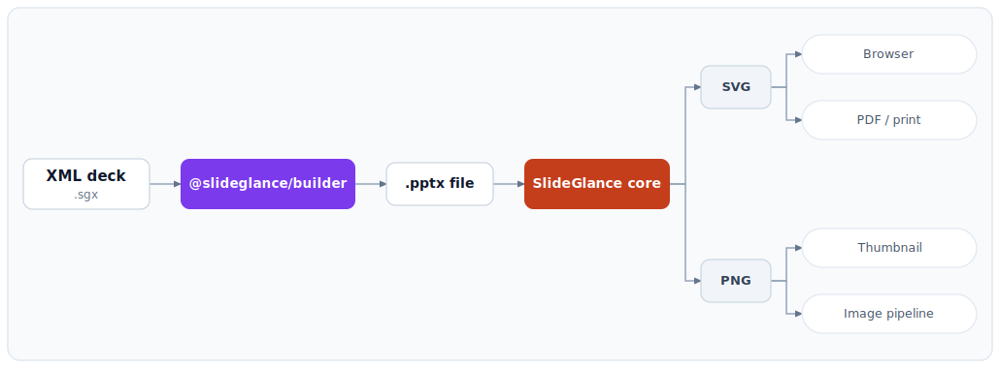
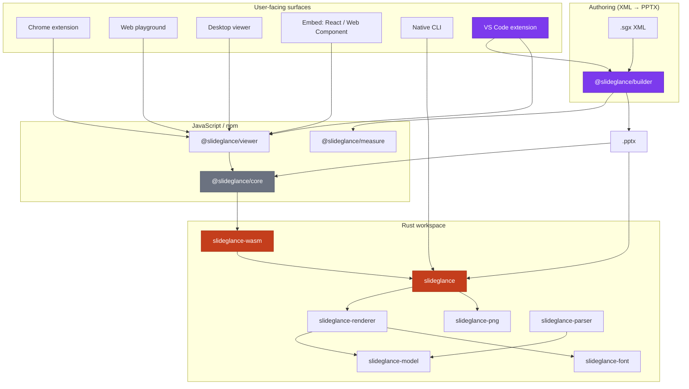

<p align="center">
  
</p>

<h1 align="center">SlideGlance</h1>

<p align="center">
  Open, view, and author PowerPoint <code>.pptx</code> files in your browser — no upload, no server, no Microsoft Office required.
</p>

<p align="center">
  <a href="https://github.com/SlideGlance/slideglance/actions/workflows/ci.yml"></a>
  <a href="https://github.com/SlideGlance/slideglance/releases/latest"></a>
  <a href="LICENSE-MIT"></a>
</p>

<p align="center">
  <a href="https://www.npmjs.com/package/@slideglance/core"></a>
  <a href="https://www.npmjs.com/package/@slideglance/viewer"></a>
  <a href="https://www.npmjs.com/package/@slideglance/measure"></a>
  <a href="https://www.npmjs.com/package/@slideglance/builder"></a>
</p>

<p align="center">
  <a href="https://www.npmjs.com/package/@slideglance/core"></a>
</p>

> ### ⚠ Pre-release / development status
>
> The npm packages — `@slideglance/core`, `@slideglance/viewer`,
> `@slideglance/measure`, and `@slideglance/builder` — are **published** and
> installable directly from npm. The Chrome Web Store extension and the
> crates.io crates are **not yet published**; any "Install" step in the table
> below marked _(once published)_ is still a placeholder — for those, follow
> the [build from source](#build-from-source) path or the
> [Chrome extension build / install / run](#chrome-extension-build--install--run)
> walkthrough.

> ### ▶ Try it now in your browser
>
> The hosted web playground is live at **<https://slideglance.github.io/slideglance/>**.
> Drag any `.pptx` onto the page and it renders entirely in your tab —
> nothing uploads, no account, no install. The same Rust + WebAssembly
> core that the desktop / Chrome / embedded surfaces use, exposed as a
> drag-and-drop SPA so you can evaluate fidelity against your own decks
> before committing to the build-from-source path.

---

## What's in the box

SlideGlance is a Rust + WebAssembly core for converting PowerPoint decks
to SVG / PNG, plus a TypeScript layer for authoring decks declaratively
from XML. The work ships across seven user-facing surfaces:

| Surface                            | What you get                                                                              | Install                                                                                                                                                                            |
| ---------------------------------- | ----------------------------------------------------------------------------------------- | ---------------------------------------------------------------------------------------------------------------------------------------------------------------------------------- |
| **Chrome extension**               | Right-click a `.pptx` link → opens in a tab. No upload.                                   | Build `apps/chrome-extension` and load unpacked, or install from the Chrome Web Store *(once published)*.                                                                          |
| **Web playground**                 | Drag-and-drop a `.pptx` into a browser tab. Useful for one-off viewing.                   | Open <https://slideglance.github.io/slideglance/playground/> — no install required. Run locally with `pnpm --filter @slideglance/web-playground dev`.                              |
| **Desktop viewer**                 | Native Tauri 2 app with menubar, drag-drop, recent files, element select.                 | Run `pnpm tauri:dev` (development) or `pnpm tauri:build` (per-OS installer).                                                                                                       |
| **Embeddable viewer**              | React component / `<pptx-viewer>` Web Component for your own app.                         | `npm i @slideglance/viewer @slideglance/core`                                                                                                                                      |
| **Native CLI**                     | `slideglance convert / render / inspect` — batch SVG / PNG conversion.                    | `cargo install slideglance` *(once published)* or build from source.                                                                                                               |
| **Rust library**                   | `slideglance::convert_to_svg / convert_to_png` for Rust pipelines.                        | `slideglance = "..."` once on crates.io, or path-dep on the workspace.                                                                                                             |
| **Slide builder (`@slideglance/builder`)** | Declarative XML → editable `.pptx`. Flexbox layout, schema validation, AI-friendly. | `npm i @slideglance/builder`                                                                                                                                                       |
| **VS Code extension (SlideGlance PPTX Viewer)** | Live preview for `.sgx` files + `.pptx` viewer, click-to-source, one-command export.  | Search **SlideGlance PPTX Viewer** in the Marketplace, or `code --install-extension slideglance.slide-builder`.                                                                              |

---

## Screenshots

Captures from the Chrome extension surface — the React viewer
underneath is the same one the desktop app, web playground, embeddable
component, and VS Code extension preview use.

| | |
| :---: | :---: |
| [](apps/chrome-extension/store-assets/screenshots/01-empty-state.png) | [](apps/chrome-extension/store-assets/screenshots/04-presentation-viewer.png) |
| **Empty state** — drag a `.pptx` or click *Open file*. Nothing leaves the tab. | **Presentation viewer** — thumbnails, ruler, slideshow, print, PDF export. |
| [](apps/chrome-extension/store-assets/screenshots/06-grid-view.png) | [](apps/chrome-extension/store-assets/screenshots/05-font-mapping-popover.png) |
| **Grid view** for scanning large decks. | **Font mapping** popover surfaces every authored-font → installed-font substitution. |
| [](apps/chrome-extension/store-assets/screenshots/02-settings-appearance.png) | [](apps/chrome-extension/store-assets/screenshots/03-settings-about.png) |
| **Settings** — theme + 8 interface languages, ruler / units. | **About** — browser-only WebAssembly engine, offline-capable, MIT. |

> Sample deck used for the screenshots: [*Business Infographic
> Presentation*](https://www.slidescarnival.com/template/business-infographic-presentation/19319)
> by SlidesCarnival.

---

## Why use it

<p align="center">
  
</p>

- **Local-first** — every file is parsed and rendered in your tab,
  process, or worker. No upload, no server roundtrip.
- **Deterministic** — same input + same fonts produces byte-identical
  SVG and pixel-identical PNG across machines.
- **Offline-capable** — once the WebAssembly bundle is loaded, the
  viewer needs zero network access.
- **Selectable text** by default — text-mode SVG keeps copy / search /
  accessibility; path-mode glyphs are available when you need
  resvg-rasterized PNG.
- **Wide PowerPoint coverage** — text wrap, theme inheritance, tables,
  charts, gradients, EMF-wrapped bitmaps, WordArt warps, transitions,
  notes, sections, and embedded fonts.
- **Author from XML** — `@slideglance/builder` compiles a small
  declarative XML grammar to real editable PPTX, so AI agents and
  pipelines can generate decks without driving a GUI.

---

## Pick your path

### ▶ End user — open a `.pptx`

- **Chrome extension** is the fastest. Once installed, every direct
  `.pptx` URL opens in a SlideGlance tab; right-click any `.pptx` link
  to send it through the viewer. Authenticated sites work because
  cookies are forwarded.
- **Drag-and-drop** a local file onto the web playground or the
  desktop app's window — no upload happens, the file is read by the
  browser / app process directly.

### ▶ Slide author — write decks in XML

```bash
npm i @slideglance/builder
```

```ts
import { buildPptx } from "@slideglance/builder";

const xml = `
<SlideGlance>
  <Document size="16:9" />
  <Slide>
    <VStack padding="48" gap="16">
      <Text fontSize="40" bold="true">Quarterly Review</Text>
      <Text fontSize="20" color="666666">Revenue +12% YoY</Text>
    </VStack>
  </Slide>
</SlideGlance>
`;

const { pptx } = await buildPptx(xml, { w: 1280, h: 720 });
await pptx.writeFile({ fileName: "review.pptx" });
```

`@slideglance/builder` ships:

- 13 visual node types (text, lists, images, tables, shapes, charts,
  lines, icons, inline SVG, plus three layout containers).
- Flexbox layout via [yoga-layout](https://yogalayout.dev/).
- `<Templates>`, `<Imports>`, `<Styles>`, master slides, `<If>` /
  `<Choose>` / `<Foreach>` for composition.
- An XSD + JSON Schema for editor validation.
- Auto-fit when content overflows the slide.

For the live editing loop, install the **SlideGlance PPTX Viewer** VS Code
extension — it gives you a webview preview, click-to-source navigation,
and one-command PPTX export against any `.sgx` file. See
[`apps/vscode-extension/README.md`](apps/vscode-extension/README.md).

For the AI-agent path, point your model at
[`packages/builder/reference.md`](packages/builder/reference.md)
— the auto-generated XML grammar reference — as a system prompt.

### ▶ Integrator — embed the viewer in your app

```bash
npm i @slideglance/viewer @slideglance/core react react-dom
```

```tsx
import { PptxPresentation, createWorkerController } from "@slideglance/viewer";
import { useEffect, useState } from "react";

function App({ src }: { src: Uint8Array }) {
  const [controller, setController] = useState(null);
  useEffect(() => {
    void createWorkerController().then(setController);
  }, []);
  return <PptxPresentation controller={controller} src={src} />;
}
```

The viewer ships toolbar + thumbnails + notes + sections + search +
theme + print + PDF export. It off-loads parsing and rendering to a
Web Worker, so the main thread stays responsive on multi-hundred-slide
decks. See [`packages/viewer/README.md`](packages/viewer/README.md) for
full props.

`@slideglance/viewer` is a React component, but the bundle also
registers a `<pptx-viewer>` Web Component for vanilla / non-React
hosts.

### ▶ Backend developer — server-side conversion

```bash
npm i @slideglance/core    # Node.js / Deno / Bun (via WASM)
```

```ts
import init, { convertPptxToSvg } from "@slideglance/core/node";
const wasmBuffer = await init();   // one-shot
const svgs = await convertPptxToSvg(pptxBytes, /* options */);
```

For Rust pipelines:

```toml
[dependencies]
slideglance = "..."   # once published
```

```rust
use slideglance::{convert_to_svg, ConvertOptions};

let bytes = std::fs::read("deck.pptx")?;
let svgs = convert_to_svg(bytes, &ConvertOptions::default())?;
for (i, svg) in svgs.iter().enumerate() {
    std::fs::write(format!("slide-{i}.svg"), svg)?;
}
```

PNG conversion (`convert_to_png`) needs a `FontResolver`; see
[`docs/en/fonts.md`](docs/en/fonts.md) for guidance.

### ▶ CLI user — batch conversion from the shell

```bash
# Every slide → SVG
slideglance convert deck.pptx --output out/

# Slide range → PNG at 1600 px wide, with explicit font set
slideglance convert deck.pptx --output out/ --format png --width 1600 --range 1-10 \
    --font /System/Library/Fonts/AppleSDGothicNeo.ttc \
    --font ~/Library/Fonts/Pretendard-Regular.otf

# One slide
slideglance render deck.pptx --slide 3 --output slide-3.png --width 1920

# Inspect deck metadata
slideglance inspect deck.pptx
```

`slideglance --help` lists every subcommand and option. For decks
containing Korean / CJK text, pass the relevant TTF / OTF / TTC files
via `--font` (repeatable) so glyph rasterization is reproducible.

---

## Chrome extension build / install / run

The Chrome extension is the path most users actually want. Until the
Web Store listing goes live, you build it locally and load it as an
unpacked extension. Steps:

```bash
# 1. Install workspace dependencies (Node ≥ 22, pnpm ≥ 10)
corepack enable && pnpm install

# 2. Build the extension (compiles slideglance-wasm, then bundles
#    everything into apps/chrome-extension/dist/)
pnpm -F @slideglance/chrome-extension build
```

Then in your Chromium-based browser (Chrome / Edge / Brave / Arc):

1. Open `chrome://extensions`.
2. Toggle **Developer mode** in the top-right.
3. Click **Load unpacked** → select `apps/chrome-extension/dist/`.
4. Pin the SlideGlance icon in the toolbar (puzzle-piece menu).

To verify the install:

- Click the toolbar icon — an empty viewer tab opens. Drop a local
  `.pptx` or click *Open file* and pick one.
- Right-click any `.pptx` link on the web → **Open with SlideGlance**
  opens it in the same viewer tab.
- Visit any direct `.pptx` URL (open conference / course pages) — the
  extension auto-redirects the navigation to a viewer tab with the
  original URL preserved in the location hash.

For live-development reload (HMR-style watching):

```bash
pnpm -F @slideglance/chrome-extension dev
```

After code edits, click the reload icon on the extension card in
`chrome://extensions`. Service-worker / manifest changes occasionally
need a full extension toggle off-and-on.

For full per-flag detail and the Chrome Web Store packaging path
(`pnpm -F @slideglance/chrome-extension package`), see
[`apps/chrome-extension/README.md`](apps/chrome-extension/README.md).

---

## Architecture



For the full layer breakdown, data flow, and crate / package
responsibilities, see [`docs/en/architecture.md`](docs/en/architecture.md).

---

## Documentation

The documentation portal is at [`docs/INDEX.md`](docs/INDEX.md) — a
language gateway that today only lists English; future translations
slot in alongside under `docs/<lang>/`. From the English root
([`docs/en/index.md`](docs/en/index.md)) you can reach every crate,
package, and app's individual doc triple (index + reference + guides).

Quick links to the most-referenced docs:

| Document                                              | What it covers                                                                                                                |
| ----------------------------------------------------- | ----------------------------------------------------------------------------------------------------------------------------- |
| [`docs/en/index.md`](docs/en/index.md)                | Workspace overview — entry point to every per-crate / per-package / per-app doc.                                              |
| [`docs/en/architecture.md`](docs/en/architecture.md)  | Layered component diagram, data flow, the constraint each crate boundary enforces.                                            |
| [`docs/en/fonts.md`](docs/en/fonts.md)                | Font pipeline reference — priority chain, path vs. text mode, per-environment behavior.                                       |
| [`docs/en/distribution.md`](docs/en/distribution.md)  | What ships where (crates.io / npm / Marketplace / etc.) and the release pipeline.                                             |
| [`docs/en/crates.md`](docs/en/crates.md)              | Navigation to every Rust crate's doc triple.                                                                                  |
| [`docs/en/packages.md`](docs/en/packages.md)          | Navigation to every npm package's doc triple.                                                                                 |
| [`docs/en/apps.md`](docs/en/apps.md)                  | Navigation to every end-user app's doc triple.                                                                                |

Each crate / package / app carries its own `docs/en/{index,reference,guides}.md`
triple. The workspace-level overview links to every member so that
navigation flows top-down from `docs/INDEX.md` into each member's
docs without leaving the repository.

---

## Build from source

For contributors only — end users can install via the channels listed
in the table at the top.

```bash
git clone https://github.com/SlideGlance/slideglance.git
cd slideglance
pnpm install
pnpm build             # full pipeline: cargo + 3 wasm targets + every JS package
pnpm --filter @slideglance/web-playground dev   # http://localhost:5173
```

Prerequisites: Rust ≥ 1.88, Node ≥ 22, `pnpm` ≥ 10, `wasm-pack`. See
[`docs/en/architecture.md#build-pipeline`](docs/en/architecture.md#build-pipeline)
for the staged build sequence and what each step produces.

After every change under `crates/`, the JS layer gets the new
WebAssembly automatically — every JS package's `prebuild` hook calls
`scripts/build-wasm.sh`, which short-circuits when nothing changed.

```bash
cargo test --workspace --release         # ~1,100 unit + integration tests
pnpm vrt                                 # visual regression on registered fixtures
cargo clippy --workspace -- -D warnings  # lint gate
```

---

## License

MIT — see [`LICENSE-MIT`](LICENSE-MIT). Copyright (c) 2026 SimpleCORE
Inc. Lead developer: Taehwan Kwag (contact via the
[GitHub issue tracker](https://github.com/SlideGlance/slideglance/issues)).

The metric-compatible OSS fonts bundled with the renderer (Cousine,
Caladea, Carlito, Liberation, Source Han Sans subsets) ship under
SIL Open Font License 1.1 — see [`LICENSE-OFL-1.1`](LICENSE-OFL-1.1)
and [`NOTICE`](NOTICE).

`@slideglance/builder` was originally derived from the `pom` library by
Hiroki Sakabe (MIT). The package has been substantially rewritten and
is distributed under the project's MIT License — see
[`packages/builder/LICENSE`](packages/builder/LICENSE) and
[`NOTICE`](NOTICE) for attribution.
