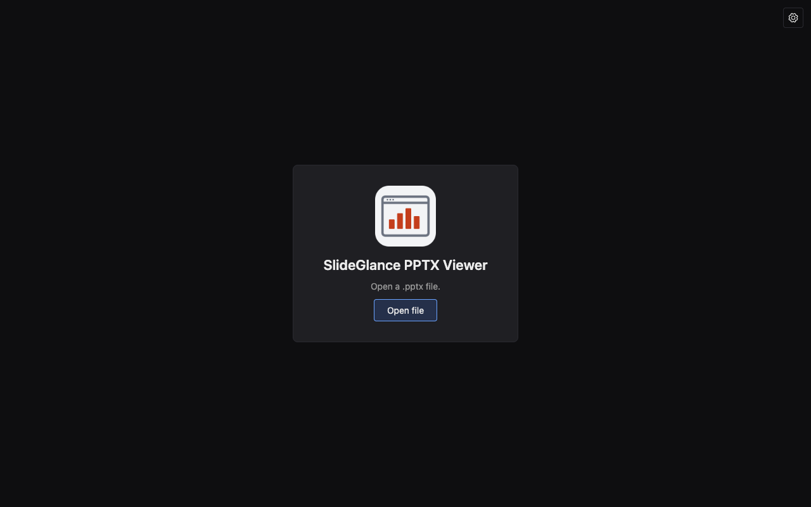
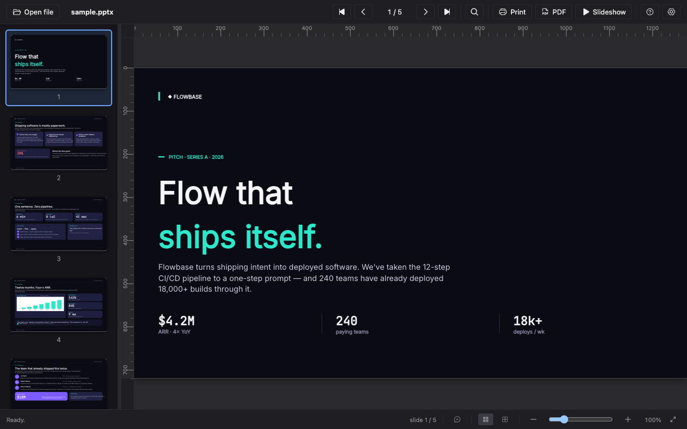
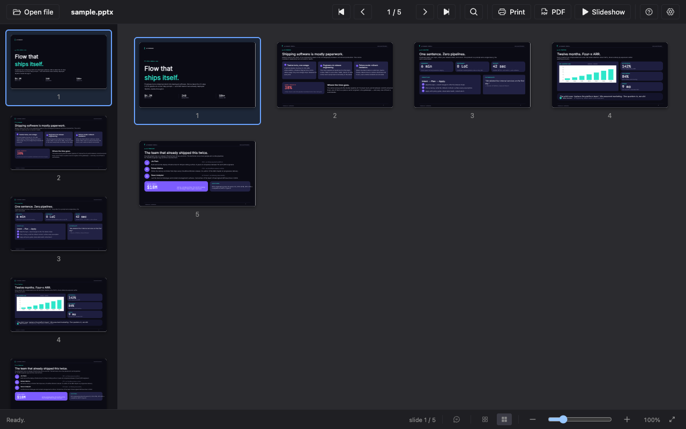
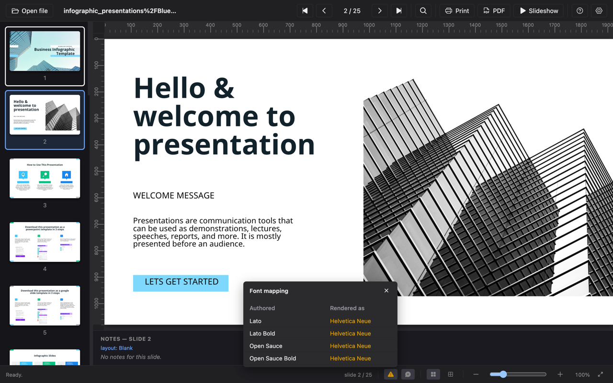
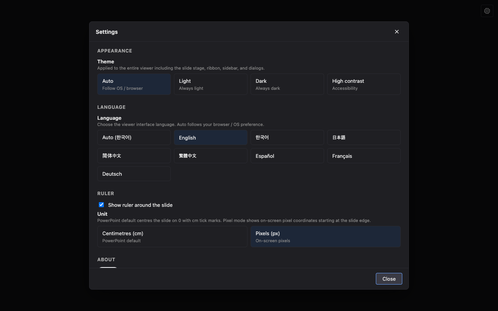
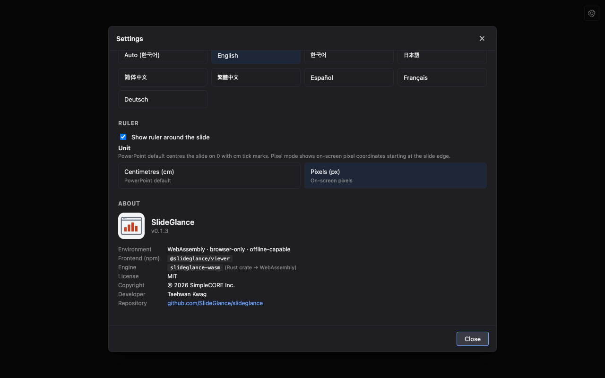

<div align="center">
  

# SlideGlance PPTX Viewer

**Open `.pptx` presentations in your browser — fully local, no upload, no server.**

Part of the [SlideGlance](https://slideglance.github.io/slideglance/) project.

</div>

---

## Why this extension

SlideGlance PPTX Viewer turns Chromium-based browsers into a fast, local-first PowerPoint viewer:

- **Local-first** — `.pptx` parsing and rendering happen entirely in the tab via WebAssembly. Files never leave your machine.
- **Same renderer everywhere** — the underlying React viewer is identical to the one used by the SlideGlance VS Code extension, the desktop app, and the embeddable component, so deck fidelity, font handling, and pixel output are consistent across surfaces.
- **No tracking** — no analytics, no error reporting, no third-party calls.

```
  any .pptx link / file ──────────────► SlideGlance PPTX Viewer tab
   (web · drive · disk · drag-drop)         (WebAssembly · local · offline-capable)
```

---

## Three ways to open a `.pptx`

| Entry point       | What happens                                                                                                                                                        |
| ----------------- | ------------------------------------------------------------------------------------------------------------------------------------------------------------------- |
| **URL intercept** | Navigating to a direct `.pptx` URL (any site, including authenticated SharePoint / Drive / intranet links) opens it in the viewer instead of triggering a download. |
| **Right-click**   | Right-click any `.pptx` link → **Open with SlideGlance** to open it in a new viewer tab.                                                                            |
| **Toolbar icon**  | Click the toolbar icon for an empty viewer tab that accepts a drag-dropped file or an _Open file_ picker.                                                           |

The viewer fetches the same URL with the user's cookies, so authenticated links keep working — but the fetched bytes stay in the tab and are never forwarded.

---

## Screenshots

|                                                                                                                                                       |                                                                                                                                           |
| :---------------------------------------------------------------------------------------------------------------------------------------------------: | :---------------------------------------------------------------------------------------------------------------------------------------: |
|                    [](./store-assets/screenshots/01-empty-state.png)                     |  [](./store-assets/screenshots/04-presentation-viewer.png)   |
|                                      **Empty state** — drop a `.pptx` or pick from disk. Nothing leaves the tab.                                      |                                **Presentation viewer** — thumbnails, ruler, slideshow, print, PDF export.                                 |
|                       [](./store-assets/screenshots/06-grid-view.png)                        | [](./store-assets/screenshots/05-font-mapping-popover.png) |
|                                                  **Grid view** for scanning large decks at a glance.                                                  |                         **Font mapping** popover shows which authored typeface resolved to which installed face.                          |
| [](./store-assets/screenshots/02-settings-appearance.png) |         [](./store-assets/screenshots/03-settings-about.png)         |
|                              **Settings** — theme + 8 interface languages (en · ko · ja · zh-CN · zh-TW · es · fr · de).                              |                                    **About** — browser-only WebAssembly engine, offline-capable, MIT.                                     |

> Captures use the bundled "Flow that ships itself" pitch sample authored in this repo (`apps/web-playground/public/samples/01-pitch.pptx`); the font-mapping capture uses a [_Business Infographic Presentation_](https://www.slidescarnival.com/template/business-infographic-presentation/19319) template by SlidesCarnival.

---

## Prerequisites

- Node ≥ 22 with `pnpm` ≥ 10 (`corepack enable` is the easiest way).
- Rust ≥ 1.88 with `wasm-pack` (the prebuild compiles `slideglance-wasm` before Vite picks it up).
- Chrome / Chromium / Edge / Brave — any Chromium-based browser with Manifest V3 support (Chrome 120+).

## Build

From the **workspace root** (`/path/to/slideglance`):

```sh
pnpm install
pnpm -F @slideglance/chrome-extension build
```

The build runs the workspace's `prebuild` (compiles `slideglance-wasm` via `wasm-pack`, syncs versions across every package), then Vite emits the unpacked extension into `apps/chrome-extension/dist/`.

For a Chrome Web Store upload zip:

```sh
pnpm -F @slideglance/chrome-extension package
# writes apps/chrome-extension/slideglance-chrome-<version>.zip
```

## Install (load unpacked into Chrome)

1. Open `chrome://extensions` in your browser.
2. Toggle **Developer mode** (top-right).
3. Click **Load unpacked** and pick `apps/chrome-extension/dist/`.
4. The SlideGlance icon appears in the toolbar — pin it for quick access via the puzzle-piece menu.

> **Updating after a code change** — re-run the build, then click the reload icon on the extension card. Service-worker / manifest changes occasionally require a full extension toggle off-and-on.

## Develop (live reload)

```sh
pnpm -F @slideglance/chrome-extension dev
```

The dev server watches the source tree and rebuilds `dist/` in place. Combined with the loaded-unpacked install above, this gives HMR for content scripts and the React UI; service-worker / manifest changes still require a `chrome://extensions` reload.

## Verify it works

1. Click the toolbar icon — an empty viewer tab opens with the **Open file** prompt.
2. Drag any local `.pptx` onto the empty state, or click _Open file_. Slides should render with the toolbar, thumbnails, and ruler.
3. Visit any direct `.pptx` URL (an academic course page or open conference site). The extension intercepts the navigation and re-opens it in the viewer.
4. Right-click a `.pptx` link → **Open with SlideGlance**.
5. Open Settings (gear icon, top-right of the empty state) and toggle the language / theme — the UI re-renders without reload.

---

## Permissions

| Permission              | Why                                                                                                                                      |
| ----------------------- | ---------------------------------------------------------------------------------------------------------------------------------------- |
| `<all_urls>` host       | Redirect any direct `.pptx` URL to the viewer; fetch the same URL with the user's cookies for authenticated sites. All processing local. |
| `declarativeNetRequest` | Registers the dynamic redirect rule on install.                                                                                          |
| `contextMenus`          | Adds the "Open with SlideGlance" right-click item.                                                                                       |

## Privacy

See [PRIVACY.md](./PRIVACY.md). Short version: no data leaves your browser.

---

## Homepage and reference documentation

- **Homepage** — [slideglance.github.io/slideglance](https://slideglance.github.io/slideglance/) — overview and links into the rest of the project.
- **Source repository** — [github.com/SlideGlance/slideglance](https://github.com/SlideGlance/slideglance) — workspace root with every crate, package, and app.
- **`@slideglance/viewer` package** — [`packages/viewer/`](https://github.com/SlideGlance/slideglance/tree/main/packages/viewer) — the React renderer powering this extension.
- **VS Code extension** — [`apps/vscode-extension/`](https://github.com/SlideGlance/slideglance/tree/main/apps/vscode-extension) — same viewer, plus authoring of `.sgx` decks that compile to editable `.pptx`.

---

## License

MIT — see [LICENSE](./LICENSE).
